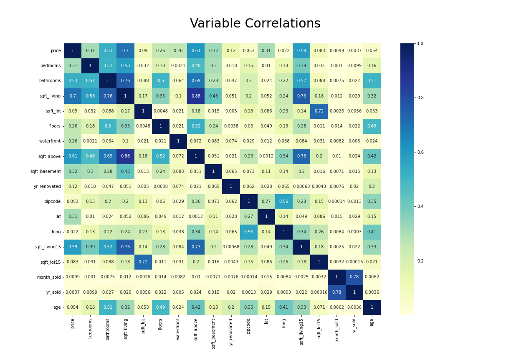
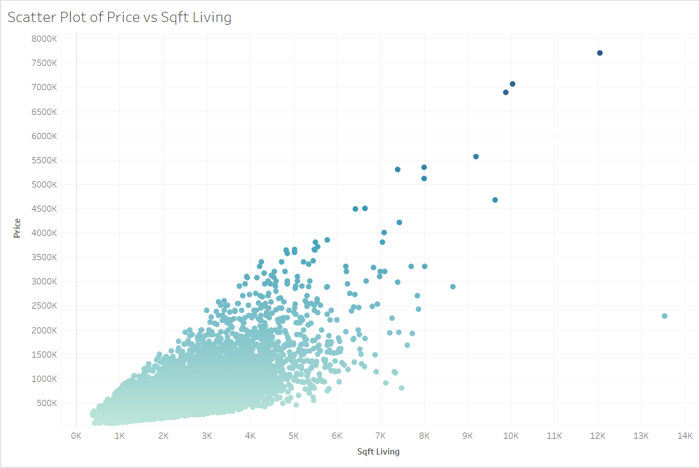
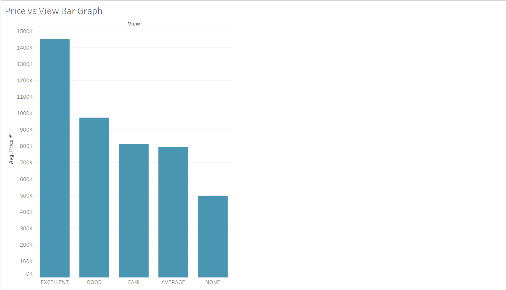

# PREDICTING KING COUNTY HOUSING PRICES

**Author**: [Jeremy Nguyo](https://github.com/NguyoJer)

## Business Problem

The role assumed here is of a Data Scientist working for Neocivil Realtors. The Agency is in the business of helping homeowners buy and/or sell houses. The Agency and the homeowners reside in King County in the US State of Washington. The Agency has provided me with a dataset of house sales in King County. The task here is to model the real estate housing prices and use the model to accurately predict the housing prices based on a number of features provided within the dataset. The expectation is that, once completed, the model can be used by them as a tool in selecting properties for investment in King County.

### Analysis Questions

This analysis will seek to answer three questions about the data:

*Question 1: Which features are most highly correlated with price?
*Question 2: Which features have the strongest correlations with other predictor variables?
*Question 3: What combinations of features is the best fit, in terms of predictive power, for a multiple regression model to predict house prices?

## Data Understanding

The dataset for the project were provided by [Moringa](https://moringaschool.com/courses/data-science-course/) School, as part of the Data Science course project. A copy of the dataset is stored in the [Data](./data/kc_house_data.csv) directory.  The data is named as 'kc_house_data.csv'. Also contained in the folder is a file named as 'column_names.md' that contains the description of the data.

The dataset contains 21 columns. One is of the prices of the houses, which is our target variable, and the res twill be used to make our predictions. The column names and their descriptions are as follows:

* **id** - unique identified for a house
* **dateDate** - house was sold
* **pricePrice** -  is prediction target
* **bedroomsNumber** -  of Bedrooms/House
* **bathroomsNumber** -  of bathrooms/bedrooms
* **sqft_livingsquare** -  footage of the home
* **sqft_lotsquare** -  footage of the lot
* **floorsTotal** -  floors (levels) in house
* **waterfront** - House which has a view to a waterfront
* **view** - Has been viewed
* **condition** - How good the condition is ( Overall )
* **grade** - overall grade given to the housing unit, based on King County grading system
* **sqft_above** - square footage of house apart from basement
* **sqft_basement** - square footage of the basement
* **yr_built** - Built Year
* **yr_renovated** - Year when house was renovated
* **zipcode** - zip
* **lat** - Latitude coordinate
* **long** - Longitude coordinate
* **sqft_living15** - The square footage of interior housing living space for the nearest 15 neighbors
* **sqft_lot15** - The square footage of the land lots of the nearest 15 neighbors

## Final Linear Regression Analysis Results

Overall the model performed marginally better than the baseline model. Comparing the Mean Absolute Error with the baseline model, we were were off by about $165,386 rather than $173,824 in a given prediction which was a slight improvement. The model explained 54.7% rather than 49.3% of the baseline model in the variance in price. 

The overall model was statistically significant with a Prob (F-statistic) of 0.00 which is less than the standard alpha of 0.05.

All of the coefficients are statistically significant with a P>|t| of 0.00 which is less than the standard alpha 0.05 except `bathrooms` which had a P>|t| above 0.05. 

Our baseline for view in this model is 'view_None' since we dropped it while one-hot encoding the categorical variables.

* The intercept(const) is at about -$60,560. This means that a house with 0 as the value for all the predictors included in the model and it has no view, then it would cost -$60,580. This is not viable because we can't have a negative cost.
* The coefficient for `sqft_living` is about $227. This means for each additional square foot of living space, the house costs about $227 more. We note that this is very similar to the `sqft_living` coefficient for the baseline model.
* The coefficient for `sqft_living15` is about $52. This means an increase of 1 square footage in average square footage of the living spaces in the neighboring 15 houses, the house price costs about $52 more.
* The coefficients for `view` range from about $119k to about $603k
  * For a view of "Average" compared to a view of "None", we expect +$119k price
  * For a view of "Excellent" compared to a view of "None"", we expect +$603k price
  * For a view of "Fair" compared to a view of "None"", we expect +$160k price
  * For a view of "Good" compared to a view of "None"", we expect +$203k price

My analysis was set to explore and answer the following questions:

#### Question 1: Which features are most highly correlated with price?

This was easily obtained by using the ~.corr()` method. 

`sqft_living` has the strongest positive correlation with price followed by `sqft_above, sqft_living15 and bathrooms` in that order. 

##### Question 2: Which features have the strongest correlations with other predictor variables?

A correlation matrix was created to visualize the correlation between the independent variables. One of the assumptions of a multiple linear regression model, is that there is no multicollinearity among the independent variables (i.e., they can't be predicted by other independent variables with high accuracy) hence the reason to create the matrix. 

To further investigate the issue of multicollinearity, I went ahead to calculate the Variation Inflation Factor. I used to a threshold of 5. Any feature that has a VIF of above is considered to be highly correlated. 

`Sqft_living, sqft_above, and sqft_basement` all had a VIF of over 5 which means they have the strongest correlations with other predictor variables.

##### Question 3: What combinations of features is the best fit, in terms of predictive power, for a multiple regression model to predict house prices?

`sqft_living, sqft_living15 and view` are the best fit for a multiple regression model. These features are highly correlated with price, have relatively low multicollinearity, and can together account for more than half of the variability of price at approximately 55%. All multiple regression assumptions are satisfied with these features included. 

For each increase of one square footage of the living space, the price of the house was projected to increase by USD 200. 

The view also has a significant impact on the price of a house. Below is a comparison to houses with no view:
  * For a view of "Excellent" compared to a view of "None"", we expect +$603k price
  * For a view of "Good" compared to a view of "None"", we expect +$203k price
  * For a view of "Fair" compared to a view of "None"", we expect +$160k price
  * For a view of "Average" compared to a view of "None", we expect +$119k price

## Conclusions
This analysis leads to three recommendations as follows:

1. The houses with the best views always fetch a good price.

2. A larger living space will increase the price of a house

3. The size of the neighboring houses affect the price of a house. The larger the neighboring houses, the higher the price of the house.

### Next Steps

Future analysis should explore the best predictors of the prices of homes outside of King County, include more predictors from this dataset such as locations, and also analyze homes sold in other years other than 2014 and 2015.

## For More Information

See the full analysis in the [Jupyter Notebook](./student.ipynb) or review this [presentation](./Presentation.pdf).
